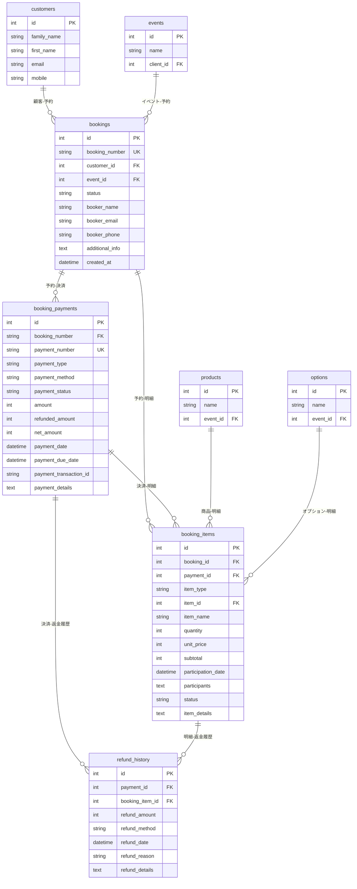

# 新予約管理システム データベース設計書

**バージョン**: 2.0  
**作成日**: 2026-02-06  
**最終更新**: 2026-02-06

## 目次

1. [概要](#概要)
2. [ER図](#er図)
3. [テーブル定義](#テーブル定義)
4. [JSON構造の詳細](#json構造の詳細)
5. [ステータス定義](#ステータス定義)
6. [インデックス一覧](#インデックス一覧)
7. [ビュー定義](#ビュー定義)
8. [ワークフロー例](#ワークフロー例)
9. [変更履歴](#変更履歴)

---

## 概要

### 設計コンセプト

新しい予約管理システムは、以下の要件に対応するために設計されています:

1. **複数決済対応**: 1つの予約に複数の決済を紐付け可能
2. **後払い決済対応**: 即時決済と後払い決済の両方に対応
3. **部分キャンセル・返金対応**: 明細単位でのキャンセル・返金処理
4. **参加者追加対応**: 予約後に参加者・商品を追加可能
5. **決済履歴管理**: すべての決済・返金の履歴を完全に追跡

### データ構造の3層アーキテクチャ

```
bookings (予約グループ)
    ├─ booking_payments (決済情報)
    │   └─ refund_history (返金履歴)
    └─ booking_items (予約明細)
```

---

## ER図

### 全体構成



---

## テーブル定義

### 1. bookings（予約グループ）

予約の基本情報を管理するテーブル。1つの予約番号に対して複数の決済・明細を紐付けます。

| カラム名 | 型 | NULL | デフォルト | 説明 |
|---------|---|------|-----------|------|
| id | INTEGER | NO | AUTO | 予約ID（主キー） |
| booking_number | TEXT | NO | - | 予約番号（例: BK20240201-001） |
| customer_id | INTEGER | NO | - | 顧客ID（外部キー） |
| event_id | INTEGER | NO | - | イベントID（外部キー） |
| status | TEXT | YES | 'active' | 予約ステータス（active, partially_canceled, fully_canceled, completed） |
| booker_name | TEXT | YES | NULL | 予約者名 |
| booker_email | TEXT | YES | NULL | 予約者メールアドレス |
| booker_phone | TEXT | YES | NULL | 予約者電話番号 |
| additional_info | TEXT | YES | NULL | その他詳細情報（JSON） |
| remarks | TEXT | YES | NULL | 備考 |
| created_at | TEXT | YES | datetime('now', 'localtime') | 作成日時 |
| modified_at | TEXT | YES | datetime('now', 'localtime') | 更新日時 |

**制約**:
- PRIMARY KEY (id)
- UNIQUE (booking_number)
- FOREIGN KEY (customer_id) REFERENCES customers(id)
- FOREIGN KEY (event_id) REFERENCES events(id)

**インデックス**:
- idx_bookings_number (booking_number)
- idx_bookings_customer (customer_id)
- idx_bookings_event (event_id)
- idx_bookings_status (status)
- idx_bookings_created (created_at)

---

### 2. booking_payments（決済情報）

決済情報を管理するテーブル。1つの予約に対して複数の決済を持つことができます。

| カラム名 | 型 | NULL | デフォルト | 説明 |
|---------|---|------|-----------|------|
| id | INTEGER | NO | AUTO | 決済ID（主キー） |
| booking_number | TEXT | NO | - | 予約番号（外部キー） |
| payment_number | TEXT | NO | - | 決済番号（例: PAY20240201-001） |
| payment_type | TEXT | NO | 'immediate' | 決済タイプ（immediate: 即時, deferred: 後払い） |
| payment_method | TEXT | NO | - | 決済方法（credit_card, convenience_store, bank_transfer） |
| payment_status | TEXT | YES | 'pending' | 決済ステータス（pending, completed, failed, expired, refunded, partially_refunded, canceled） |
| amount | INTEGER | NO | - | 決済金額（元の金額） |
| refunded_amount | INTEGER | YES | 0 | 返金済み金額（累積） |
| net_amount | INTEGER | NO | 計算 | 実質金額（amount - refunded_amount） |
| payment_date | TEXT | YES | NULL | 実際の決済日 |
| payment_due_date | TEXT | YES | NULL | 支払い期限（後払いの場合） |
| refund_date | TEXT | YES | NULL | 返金日 |
| payment_transaction_id | TEXT | YES | NULL | トランザクションID |
| payment_details | TEXT | YES | NULL | 決済詳細（JSON） |
| remarks | TEXT | YES | NULL | 備考 |
| created_at | TEXT | YES | datetime('now', 'localtime') | 作成日時 |
| modified_at | TEXT | YES | datetime('now', 'localtime') | 更新日時 |

**制約**:
- PRIMARY KEY (id)
- UNIQUE (payment_number)
- FOREIGN KEY (booking_number) REFERENCES bookings(booking_number)
- GENERATED ALWAYS AS (amount - refunded_amount) STORED (net_amount)

**インデックス**:
- idx_booking_payments_number (payment_number)
- idx_booking_payments_booking (booking_number)
- idx_booking_payments_status (payment_status)
- idx_booking_payments_method (payment_method)
- idx_booking_payments_transaction (payment_transaction_id)
- idx_booking_payments_date (payment_date)
- idx_booking_payments_due (payment_due_date)

---

### 3. booking_items（予約明細）

予約の明細情報を管理するテーブル。商品・オプション・参加者情報を保持します。

| カラム名 | 型 | NULL | デフォルト | 説明 |
|---------|---|------|-----------|------|
| id | INTEGER | NO | AUTO | 明細ID（主キー） |
| booking_id | INTEGER | NO | - | 予約ID（外部キー） |
| payment_id | INTEGER | YES | NULL | 決済ID（外部キー） |
| item_type | TEXT | NO | - | 明細タイプ（product, option, discount） |
| item_id | INTEGER | NO | - | 商品ID or オプションID |
| item_name | TEXT | NO | - | 商品名 or オプション名 |
| stock_id | INTEGER | YES | NULL | 在庫ID |
| price_category | TEXT | YES | NULL | 料金カテゴリ |
| quantity | INTEGER | YES | 1 | 数量（人数・個数） |
| unit_price | INTEGER | NO | - | 単価 |
| subtotal | INTEGER | NO | - | 小計 |
| participation_date | TEXT | YES | NULL | 参加日 |
| participants | TEXT | YES | NULL | 参加者情報（JSON配列） |
| status | TEXT | YES | 'active' | 明細ステータス（active, canceled, refunded） |
| canceled_at | TEXT | YES | NULL | キャンセル日時 |
| cancel_reason | TEXT | YES | NULL | キャンセル理由 |
| refund_amount | INTEGER | YES | 0 | この明細の返金額 |
| item_details | TEXT | YES | NULL | その他詳細情報（JSON） |
| remarks | TEXT | YES | NULL | 備考 |
| created_at | TEXT | YES | datetime('now', 'localtime') | 作成日時 |
| modified_at | TEXT | YES | datetime('now', 'localtime') | 更新日時 |

**制約**:
- PRIMARY KEY (id)
- FOREIGN KEY (booking_id) REFERENCES bookings(id)
- FOREIGN KEY (payment_id) REFERENCES booking_payments(id)

**インデックス**:
- idx_booking_items_booking (booking_id)
- idx_booking_items_payment (payment_id)
- idx_booking_items_type_id (item_type, item_id)
- idx_booking_items_status (status)
- idx_booking_items_participation (participation_date)

---

### 4. refund_history（返金履歴）

返金の履歴を管理するテーブル。部分返金・複数回返金に対応します。

| カラム名 | 型 | NULL | デフォルト | 説明 |
|---------|---|------|-----------|------|
| id | INTEGER | NO | AUTO | 返金履歴ID（主キー） |
| payment_id | INTEGER | NO | - | 決済ID（外部キー） |
| booking_item_id | INTEGER | YES | NULL | 明細ID（外部キー） |
| refund_amount | INTEGER | NO | - | 返金額 |
| refund_method | TEXT | YES | NULL | 返金方法（original_payment, bank_transfer） |
| refund_date | TEXT | YES | datetime('now', 'localtime') | 返金日 |
| refund_transaction_id | TEXT | YES | NULL | 返金トランザクションID |
| refund_reason | TEXT | YES | NULL | 簡易理由（customer_request, event_canceled, error） |
| refund_details | TEXT | YES | NULL | 返金詳細（JSON） |
| remarks | TEXT | YES | NULL | 備考 |
| created_at | TEXT | YES | datetime('now', 'localtime') | 作成日時 |

**制約**:
- PRIMARY KEY (id)
- FOREIGN KEY (payment_id) REFERENCES booking_payments(id)
- FOREIGN KEY (booking_item_id) REFERENCES booking_items(id)

**インデックス**:
- idx_refund_history_payment (payment_id)
- idx_refund_history_item (booking_item_id)
- idx_refund_history_date (refund_date)
- idx_refund_history_reason (refund_reason)

---

## JSON構造の詳細

### bookings.additional_info

```json
{
  "address": "東京都千代田区丸の内1-1-1",
  "company": "株式会社テスト",
  "department": "営業部",
  "special_requests": "車椅子対応希望",
  "referral_source": "Web広告"
}
```

### booking_payments.payment_details

```json
{
  "credit_card": {
    "brand": "VISA",
    "last4": "1234",
    "approval_code": "ABC123",
    "installments": 1
  },
  "convenience_store": {
    "store_name": "セブンイレブン",
    "payment_code": "12345678901234",
    "barcode_url": "https://example.com/barcode.png"
  },
  "bank_transfer": {
    "bank_name": "三菱UFJ銀行",
    "branch_name": "東京支店",
    "account_type": "普通",
    "account_number": "1234567",
    "account_holder": "カ）テスト"
  }
}
```

### booking_items.participants

参加者情報は配列形式で複数の参加者を保持します。各参加者は以下のフィールドを持ちます。

**基本フィールド**:
- `lastname` (string, required): 姓
- `firstname` (string, required): 名
- `age` (integer, optional): 年齢
- `gender` (string, optional): 性別
- `email` (string, optional): メールアドレス
- `phone` (string, optional): 電話番号
- `birth` (string, optional): 生年月日（YYYY-MM-DD形式）
- `custom_fields` (object, optional): 付加情報（フォーム設定による追加項目）

**構造例**:
```json
[
  {
    "lastname": "山田",
    "firstname": "太郎",
    "age": 39,
    "gender": "男性",
    "email": "yamada.taro@example.com",
    "phone": "090-1234-5678",
    "birth": "1985-03-15",
    "custom_fields": {
      "お弁当": "洋食",
      "ドリンク": "ビール",
      "座席希望": "窓側"
    }
  },
  {
    "lastname": "山田",
    "firstname": "花子",
    "age": 37,
    "gender": "女性",
    "email": "yamada.hanako@example.com",
    "phone": "090-8765-4321",
    "birth": "1987-06-20",
    "custom_fields": {
      "お弁当": "和食",
      "ドリンク": "ワイン",
      "アレルギー": "そば"
    }
  }
]
```

**custom_fields の使用例**:
- イベント固有の質問項目（食事の希望、座席の希望など）
- アンケート回答
- 特別な対応が必要な情報（アレルギー、車椅子対応など）
- Tシャツサイズ、ゼッケン番号など

### booking_items.item_details

```json
{
  "seat": {
    "section": "A",
    "row": 10,
    "number": 15
  },
  "meal_preferences": {
    "vegetarian": false,
    "halal": false,
    "allergies": ["そば"]
  },
  "survey_answers": {
    "how_did_you_hear": "Web広告",
    "motivation": "友人の紹介"
  }
}
```

### refund_history.refund_details

```json
{
  "reason_category": "customer_request",
  "detailed_reason": "体調不良のため参加できなくなった",
  "supporting_documents": [
    {
      "type": "medical_certificate",
      "url": "https://example.com/docs/medical_cert.pdf"
    }
  ],
  "approved_by": "管理者A",
  "approval_date": "2024-02-05 10:30:00",
  "refund_policy": "全額返金（開催7日前まで）"
}
```

---

## ステータス定義

### bookings.status（予約ステータス）

| 値 | 説明 | 説明詳細 |
|----|------|----------|
| active | 有効 | 予約が有効（決済完了・未完了問わず） |
| partially_canceled | 一部キャンセル | 一部の明細がキャンセルされた |
| fully_canceled | 全キャンセル | すべての明細がキャンセルされた |
| completed | 完了 | イベント終了後 |

### booking_payments.payment_type（決済タイプ）

| 値 | 説明 | 説明詳細 |
|----|------|----------|
| immediate | 即時決済 | 予約と同時に決済 |
| deferred | 後払い決済 | 支払い期限内に決済 |

### booking_payments.payment_status（決済ステータス）

| 値 | 説明 | フロー |
|----|------|--------|
| pending | 決済待ち | 初期状態（後払いの場合は支払い期限前） |
| completed | 決済完了 | pending → completed |
| failed | 決済失敗 | pending → failed |
| expired | 期限切れ | pending → expired（後払いのみ） |
| refunded | 全額返金済み | completed → refunded |
| partially_refunded | 一部返金済み | completed → partially_refunded |
| canceled | キャンセル | pending → canceled（決済前のキャンセル） |

### booking_payments.payment_method（決済方法）

| 値 | 説明 |
|----|------|
| credit_card | クレジットカード |
| convenience_store | コンビニ決済 |
| bank_transfer | 銀行振込 |

### booking_items.status（明細ステータス）

| 値 | 説明 | 説明詳細 |
|----|------|----------|
| active | 有効 | 有効な明細 |
| canceled | キャンセル | キャンセルされた（返金なし） |
| refunded | 返金済み | キャンセルされ返金された |

### refund_history.refund_reason（返金理由）

| 値 | 説明 |
|----|------|
| customer_request | 顧客都合 |
| event_canceled | イベント中止 |
| error | システムエラー |

---

## インデックス一覧

### bookings

- idx_bookings_number (booking_number) - 予約番号検索
- idx_bookings_customer (customer_id) - 顧客別予約検索
- idx_bookings_event (event_id) - イベント別予約検索
- idx_bookings_status (status) - ステータス別検索
- idx_bookings_created (created_at) - 作成日時ソート

### booking_payments

- idx_booking_payments_number (payment_number) - 決済番号検索
- idx_booking_payments_booking (booking_number) - 予約別決済検索
- idx_booking_payments_status (payment_status) - ステータス別検索
- idx_booking_payments_method (payment_method) - 決済方法別検索
- idx_booking_payments_transaction (payment_transaction_id) - トランザクションID検索
- idx_booking_payments_date (payment_date) - 決済日検索
- idx_booking_payments_due (payment_due_date) - 支払期限検索

### booking_items

- idx_booking_items_booking (booking_id) - 予約別明細検索
- idx_booking_items_payment (payment_id) - 決済別明細検索
- idx_booking_items_type_id (item_type, item_id) - 商品・オプション別検索
- idx_booking_items_status (status) - ステータス別検索
- idx_booking_items_participation (participation_date) - 参加日検索

### refund_history

- idx_refund_history_payment (payment_id) - 決済別返金履歴検索
- idx_refund_history_item (booking_item_id) - 明細別返金履歴検索
- idx_refund_history_date (refund_date) - 返金日検索
- idx_refund_history_reason (refund_reason) - 返金理由別検索

---

## ビュー定義

### v_bookings_list（予約一覧ビュー）

予約の一覧を取得するためのビュー。決済情報や合計金額を含みます。

```sql
CREATE VIEW v_bookings_list AS
SELECT 
  b.id,
  b.booking_number,
  b.customer_id,
  c.family_name || ' ' || c.first_name AS customer_name,
  c.email AS customer_email,
  c.mobile AS customer_phone,
  b.event_id,
  e.name AS event_name,
  b.status AS booking_status,
  b.booker_name,
  b.booker_email,
  b.booker_phone,
  
  -- 最新の決済ステータス
  (SELECT bp.payment_status FROM booking_payments bp 
   WHERE bp.booking_number = b.booking_number 
   ORDER BY bp.created_at DESC LIMIT 1) AS latest_payment_status,
  
  -- 合計金額（実質金額の合計）
  (SELECT COALESCE(SUM(bp.net_amount), 0) FROM booking_payments bp 
   WHERE bp.booking_number = b.booking_number) AS total_amount,
  
  -- 返金済み金額の合計
  (SELECT COALESCE(SUM(bp.refunded_amount), 0) FROM booking_payments bp 
   WHERE bp.booking_number = b.booking_number) AS total_refunded,
  
  b.created_at,
  b.modified_at
FROM bookings b
LEFT JOIN customers c ON b.customer_id = c.id
LEFT JOIN events e ON b.event_id = e.id;
```

### v_booking_payments_list（決済一覧ビュー）

決済の一覧を取得するためのビュー。明細件数や参加者総数を含みます。

```sql
CREATE VIEW v_booking_payments_list AS
SELECT 
  bp.id,
  bp.booking_number,
  bp.payment_number,
  bp.payment_type,
  bp.payment_method,
  bp.payment_status,
  bp.amount,
  bp.refunded_amount,
  bp.net_amount,
  bp.payment_date,
  bp.payment_due_date,
  bp.refund_date,
  bp.payment_transaction_id,
  
  -- 明細件数
  (SELECT COUNT(*) FROM booking_items bi 
   WHERE bi.payment_id = bp.id) AS item_count,
  
  -- 参加者総数
  (SELECT COALESCE(SUM(bi.quantity), 0) FROM booking_items bi 
   WHERE bi.payment_id = bp.id AND bi.status = 'active') AS total_participants,
  
  bp.created_at,
  bp.modified_at
FROM booking_payments bp;
```

---

## ワークフロー例

### シナリオ: 商品A+B予約 → 商品C追加 → 商品Cキャンセル

#### ステップ1: 最初の予約（商品A+B、クレジットカード）

```sql
-- 1. 予約グループ作成
INSERT INTO bookings (booking_number, customer_id, event_id, booker_name, booker_email, booker_phone)
VALUES ('BK20240201-001', 1, 1, '山田太郎', 'taro@example.com', '090-1234-5678');

-- 2. 決済作成（即時決済、クレジットカード）
INSERT INTO booking_payments (
  booking_number, payment_number, payment_type, payment_method,
  payment_status, amount, payment_date
) VALUES (
  'BK20240201-001', 'PAY20240201-001', 'immediate', 'credit_card',
  'completed', 10000, datetime('now', 'localtime')
);

-- 3. 明細追加（商品A × 2名）
INSERT INTO booking_items (
  booking_id, payment_id, item_type, item_id, item_name,
  quantity, unit_price, subtotal, participants
) VALUES (
  1, 1, 'product', 1, '一般入場券',
  2, 2500, 5000,
  '[{"name":"山田太郎","age":39},{"name":"山田花子","age":37}]'
);

-- 4. 明細追加（商品B × 2名）
INSERT INTO booking_items (
  booking_id, payment_id, item_type, item_id, item_name,
  quantity, unit_price, subtotal, participants
) VALUES (
  1, 1, 'product', 2, 'VIP入場券',
  2, 2500, 5000,
  '[{"name":"山田太郎","age":39},{"name":"山田花子","age":37}]'
);
```

#### ステップ2: 追加予約（商品C、コンビニ後払い、参加者1名追加）

```sql
-- 1. 決済作成（後払い、コンビニ）
INSERT INTO booking_payments (
  booking_number, payment_number, payment_type, payment_method,
  payment_status, amount, payment_due_date
) VALUES (
  'BK20240201-001', 'PAY20240205-001', 'deferred', 'convenience_store',
  'pending', 3000, '2024-02-10'
);

-- 2. 明細追加（商品C × 3名: 既存2名 + 新規1名）
INSERT INTO booking_items (
  booking_id, payment_id, item_type, item_id, item_name,
  quantity, unit_price, subtotal, participants
) VALUES (
  1, 2, 'product', 3, 'ランチオプション',
  3, 1000, 3000,
  '[{"name":"山田太郎","age":39},{"name":"山田花子","age":37},{"name":"山田次郎","age":10}]'
);
```

#### ステップ3: 商品Cキャンセル（決済前）

```sql
-- 1. 明細をキャンセル
UPDATE booking_items SET
  status = 'canceled',
  canceled_at = datetime('now', 'localtime'),
  cancel_reason = '顧客都合'
WHERE id = 3;

-- 2. 決済をキャンセル
UPDATE booking_payments SET
  payment_status = 'canceled'
WHERE id = 2;

-- 3. 予約グループのステータス更新
UPDATE bookings SET
  status = 'partially_canceled'
WHERE id = 1;
```

#### ステップ3': 商品Cキャンセル（決済後の場合）

```sql
-- 1. 明細を返金済みに更新
UPDATE booking_items SET
  status = 'refunded',
  canceled_at = datetime('now', 'localtime'),
  cancel_reason = '顧客都合',
  refund_amount = 3000
WHERE id = 3;

-- 2. 返金履歴を記録
INSERT INTO refund_history (payment_id, booking_item_id, refund_amount, refund_reason)
VALUES (2, 3, 3000, 'customer_request');

-- 3. 決済を返金済みに更新
UPDATE booking_payments SET
  payment_status = 'refunded',
  refunded_amount = 3000,
  refund_date = datetime('now', 'localtime')
WHERE id = 2;

-- 4. 予約グループのステータス更新
UPDATE bookings SET
  status = 'partially_canceled'
WHERE id = 1;
```

---

## 変更履歴

| バージョン | 日付 | 変更内容 |
|-----------|------|----------|
| 2.0 | 2026-02-06 | 新予約管理システム設計書を作成。複数決済対応、後払い対応、部分キャンセル・返金対応、参加者追加対応。 |
| 1.0 | 2024-02-01 | 初版。product_bookingsテーブルのみの設計。 |

---

## 補足資料

### 旧システム（product_bookings）との違い

| 項目 | 旧システム | 新システム |
|------|-----------|-----------|
| 予約管理 | product_bookings 1テーブル | bookings + booking_payments + booking_items 3テーブル |
| 複数決済 | 非対応（1予約 = 1決済） | 対応（1予約 = N決済） |
| 後払い | 対応が難しい | payment_type, payment_due_dateで対応 |
| 返金履歴 | 非対応 | refund_historyテーブルで完全追跡 |
| 参加者追加 | 非対応 | booking_itemsを追加するだけで対応可能 |
| JSON活用 | 限定的 | participants, payment_details, item_detailsで柔軟に管理 |

### 推奨クエリパターン

#### 予約の詳細を取得

```sql
SELECT 
  b.*,
  json_group_array(DISTINCT json_object(
    'payment_number', bp.payment_number,
    'payment_method', bp.payment_method,
    'payment_status', bp.payment_status,
    'amount', bp.amount,
    'net_amount', bp.net_amount
  )) AS payments,
  json_group_array(DISTINCT json_object(
    'item_name', bi.item_name,
    'quantity', bi.quantity,
    'subtotal', bi.subtotal,
    'status', bi.status
  )) AS items
FROM bookings b
LEFT JOIN booking_payments bp ON b.booking_number = bp.booking_number
LEFT JOIN booking_items bi ON b.id = bi.booking_id
WHERE b.booking_number = 'BK20240201-001'
GROUP BY b.id;
```

#### 未払い決済の一覧を取得

```sql
SELECT *
FROM v_booking_payments_list
WHERE payment_status = 'pending'
  AND payment_type = 'deferred'
  AND payment_due_date >= date('now')
ORDER BY payment_due_date ASC;
```

#### 返金履歴を取得

```sql
SELECT 
  rh.*,
  bp.payment_number,
  bp.payment_method,
  bi.item_name
FROM refund_history rh
LEFT JOIN booking_payments bp ON rh.payment_id = bp.id
LEFT JOIN booking_items bi ON rh.booking_item_id = bi.id
ORDER BY rh.refund_date DESC;
```

---

**以上**
