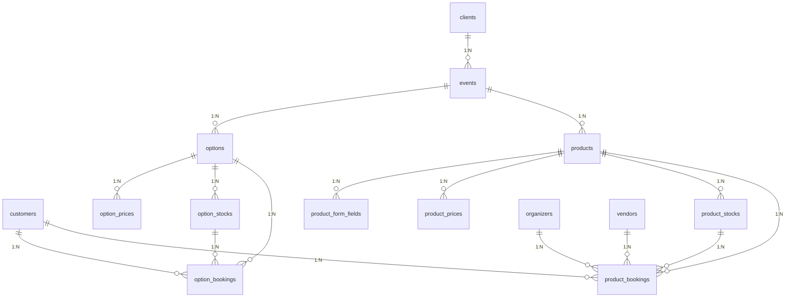
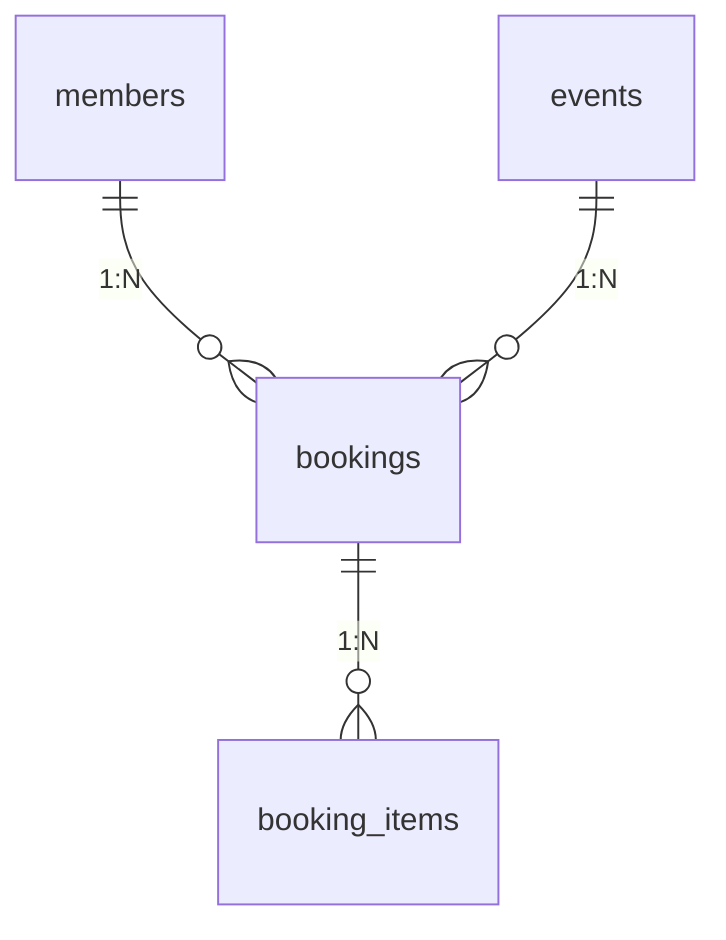

# 予約管理システム - テーブルリレーション図

## 作成日
2026-02-06

## バージョン
1.0

---

## 概要

このドキュメントは、予約管理システムにおける各テーブル間のリレーション（関連性）を詳細に説明します。

**注意**: 
- **主要な予約システム**: customers → product_bookings（本ドキュメントの中心）
- **会員予約システム**: members → bookings → booking_items（別システム、参考として記載）

---

## 全体構成図



**参考: 会員予約システム（別システム）**


---

## テーブル間リレーション詳細

### 1. イベント関連のリレーション

#### 1.1 clients → events（クライアント → イベント）
- **関係**: 1:N（1つのクライアントは複数のイベントを持つ）
- **外部キー**: events.client_id → clients.id
- **説明**: クライアント企業が主催する複数のイベントを管理

```
clients (1)
   │
   │ client_id
   ▼
events (N)
```

**例:**
```
株式会社テストクライアント（client_id=1）
  ├─ 東京サマーフェスティバル2024（event_id=1）
  ├─ 京都クラシックコンサート（event_id=3）
  └─ 福岡ビジネスセミナー（event_id=6）
```

#### 1.2 events → products（イベント → 商品）
- **関係**: 1:N（1つのイベントは複数の商品を持つ）
- **外部キー**: products.event_id → events.id
- **説明**: イベントで販売される複数の商品（チケット種類など）を管理

```
events (1)
   │
   │ event_id
   ▼
products (N)
```

**例:**
```
東京サマーフェスティバル2024（event_id=1）
  ├─ 一般入場券（product_id=1、価格: 2,500円）
  ├─ VIP入場券（product_id=2、価格: 10,000円）
  └─ 学生入場券（product_id=10、価格: 1,500円）
```

#### 1.3 events → options（イベント → オプション）
- **関係**: 1:N（1つのイベントは複数のオプションを持つ）
- **外部キー**: options.event_id → events.id
- **説明**: イベントで提供される追加オプション（食事、記念品など）を管理

```
events (1)
   │
   │ event_id
   ▼
options (N)
```

**例:**
```
東京サマーフェスティバル2024（event_id=1）
  ├─ ランチボックス（option_id=1、価格: 1,000円）
  ├─ 記念Tシャツ（option_id=2、価格: 2,000円）
  └─ パンフレット（option_id=3、価格: 500円）
```

---

### 2. 商品関連のリレーション

#### 2.1 products → product_stocks（商品 → 商品在庫）
- **関係**: 1:N（1つの商品は複数の在庫レコードを持つ）
- **外部キー**: product_stocks.product_id → products.id
- **説明**: 日付別・カテゴリ別の在庫を管理

```
products (1)
   │
   │ product_id
   ▼
product_stocks (N)
```

**例:**
```
一般入場券（product_id=1）
  ├─ 2024-08-15（stock_id=1、在庫: 100、予約済: 50）
  ├─ 2024-08-16（stock_id=2、在庫: 100、予約済: 30）
  └─ 2024-08-17（stock_id=3、在庫: 100、予約済: 0）
```

#### 2.2 products → product_prices（商品 → 商品価格）
- **関係**: 1:N（1つの商品は複数の価格カテゴリを持つ）
- **外部キー**: product_prices.product_id → products.id
- **説明**: カテゴリ別（大人・子供など）の価格を管理

```
products (1)
   │
   │ product_id
   ▼
product_prices (N)
```

**例:**
```
一般入場券（product_id=1）
  ├─ 大人（price_id=1、価格: 2,500円）
  ├─ 子供（price_id=2、価格: 1,500円）
  └─ シニア（price_id=3、価格: 2,000円）
```

#### 2.3 products → product_form_fields（商品 → 商品フォーム項目）
- **関係**: 1:N（1つの商品は複数のフォーム項目を持つ）
- **外部キー**: product_form_fields.product_id → products.id
- **説明**: 予約時に入力するカスタムフォーム項目を管理

```
products (1)
   │
   │ product_id
   ▼
product_form_fields (N)
```

**例:**
```
フルマラソン参加（product_id=3）
  ├─ Tシャツサイズ（field_id=1、種類: select、必須: Yes）
  ├─ 緊急連絡先（field_id=2、種類: text、必須: Yes）
  └─ 食物アレルギー（field_id=3、種類: textarea、必須: No）
```

---

### 3. オプション関連のリレーション

#### 3.1 options → option_stocks（オプション → オプション在庫）
- **関係**: 1:N（1つのオプションは複数の在庫レコードを持つ）
- **外部キー**: option_stocks.option_id → options.id
- **説明**: 日付別の在庫を管理

```
options (1)
   │
   │ option_id
   ▼
option_stocks (N)
```

**例:**
```
ランチボックス（option_id=1）
  ├─ 2024-08-15（stock_id=1、在庫: 50、予約済: 30）
  ├─ 2024-08-16（stock_id=2、在庫: 50、予約済: 20）
  └─ 2024-08-17（stock_id=3、在庫: 50、予約済: 0）
```

#### 3.2 options → option_prices（オプション → オプション価格）
- **関係**: 1:N（1つのオプションは複数の価格カテゴリを持つ）
- **外部キー**: option_prices.option_id → options.id
- **説明**: カテゴリ別の価格を管理

```
options (1)
   │
   │ option_id
   ▼
option_prices (N)
```

**例:**
```
ランチボックス（option_id=1）
  ├─ 大人用（price_id=1、価格: 1,000円）
  └─ 子供用（price_id=2、価格: 500円）
```

---

### 4. 予約関連のリレーション

#### 4.1 customers → product_bookings（顧客 → 商品予約）
- **関係**: 1:N（1人の顧客は複数の商品予約を持つ）
- **外部キー**: product_bookings.customer_id → customers.id
- **説明**: 顧客が行った複数の商品予約を管理

```
customers (1)
   │
   │ customer_id
   ▼
product_bookings (N)
```

**例:**
```
山田太郎（customer_id=1）
  ├─ BK20240201-001（東京サマーフェスティバル、一般入場券×2）
  ├─ BK20240208-001（東京サマーフェスティバル、一般入場券×3）
  └─ BK20240305-001（京都クラシックコンサート、S席×2）
```

#### 4.2 customers → option_bookings（顧客 → オプション予約）
- **関係**: 1:N（1人の顧客は複数のオプション予約を持つ）
- **外部キー**: option_bookings.customer_id → customers.id
- **説明**: 顧客が追加したオプションを管理

```
customers (1)
   │
   │ customer_id
   ▼
option_bookings (N)
```

**例:**
```
山田太郎（customer_id=1）
  ├─ ランチボックス×2（option_booking_id=1）
  └─ 記念Tシャツ×2（option_booking_id=2）
```

#### 4.3 products → product_bookings（商品 → 商品予約）
- **関係**: 1:N（1つの商品は複数の予約を持つ）
- **外部キー**: product_bookings.product_id → products.id
- **説明**: 商品ごとの予約履歴を管理

```
products (1)
   │
   │ product_id
   ▼
product_bookings (N)
```

**例:**
```
一般入場券（product_id=1）
  ├─ BK20240201-001（山田太郎、2枚、2024-08-15）
  ├─ BK20240202-001（佐藤花子、1枚、2024-08-15）
  └─ BK20240208-001（山田太郎、3枚、2024-08-16）
```

#### 4.4 product_stocks → product_bookings（商品在庫 → 商品予約）
- **関係**: 1:N（1つの在庫レコードは複数の予約を持つ）
- **外部キー**: product_bookings.product_stock_id → product_stocks.id
- **説明**: 特定日付の在庫に対する予約を紐付け

```
product_stocks (1)
   │
   │ product_stock_id
   ▼
product_bookings (N)
```

**例:**
```
一般入場券 2024-08-15（stock_id=1、在庫: 100）
  ├─ BK20240201-001（2枚予約）
  ├─ BK20240202-001（1枚予約）
  └─ BK20240205-001（3枚予約）
  合計予約済: 6枚、残り: 94枚
```

#### 4.5 options → option_bookings（オプション → オプション予約）
- **関係**: 1:N（1つのオプションは複数の予約を持つ）
- **外部キー**: option_bookings.option_id → options.id
- **説明**: オプションごとの予約履歴を管理

```
options (1)
   │
   │ option_id
   ▼
option_bookings (N)
```

#### 4.6 option_stocks → option_bookings（オプション在庫 → オプション予約）
- **関係**: 1:N（1つの在庫レコードは複数の予約を持つ）
- **外部キー**: option_bookings.option_stock_id → option_stocks.id
- **説明**: 特定日付の在庫に対する予約を紐付け

```
option_stocks (1)
   │
   │ option_stock_id
   ▼
option_bookings (N)
```

---

### 5. 会員予約システム関連のリレーション（参考）

**注意**: このセクションは別の予約システム（members → bookings → booking_items）を説明しています。現在の主要な予約システムは customers → product_bookings です。

#### 5.1 members → bookings（会員 → 統合予約）※別システム
- **関係**: 1:N（1人の会員は複数の予約を持つ）
- **外部キー**: bookings.member_id → members.id
- **説明**: 会員システムを使用した予約を管理（別システム）
- **テーブル**: membersテーブルは別途管理されており、本ドキュメントのDDLには含まれていません

```
members (1)
   │
   │ member_id
   ▼
bookings (N)
```

**例:**
```
田中一郎会員（member_id=1）
  ├─ MB20240301-001（東京イベント、合計: 15,000円）
  └─ MB20240315-001（大阪イベント、合計: 8,000円）
```

#### 5.2 events → bookings（イベント → 統合予約）※別システム
- **関係**: 1:N（1つのイベントは複数の予約を持つ）
- **外部キー**: bookings.event_id → events.id
- **説明**: イベントごとの予約を管理（別システム）

```
events (1)
   │
   │ event_id
   ▼
bookings (N)
```

#### 5.3 bookings → booking_items（統合予約 → 予約明細）※別システム
- **関係**: 1:N（1つの予約は複数の明細を持つ）
- **外部キー**: booking_items.booking_id → bookings.id
- **説明**: 1つの予約に含まれる複数の商品・オプションを明細として管理（別システム）

```
bookings (1)
   │
   │ booking_id
   ▼
booking_items (N)
```

**例:**
```
MB20240301-001（予約合計: 15,000円）
  ├─ 商品: 一般入場券×2（小計: 5,000円）
  ├─ 商品: VIP入場券×1（小計: 10,000円）
  ├─ オプション: ランチボックス×2（小計: 2,000円）
  └─ オプション: 記念品×1（小計: 1,000円）
  総合計: 18,000円
```

---

### 6. その他のリレーション

#### 6.1 organizers → product_bookings（主催者 → 商品予約）
- **関係**: 1:N（1つの主催者は複数の予約を管理）
- **外部キー**: product_bookings.organizer_id → organizers.id
- **説明**: 主催者別の予約を管理（レポート用）

```
organizers (1)
   │
   │ organizer_id
   ▼
product_bookings (N)
```

#### 6.2 vendors → product_bookings（販売会社 → 商品予約）
- **関係**: 1:N（1つの販売会社は複数の予約を管理）
- **外部キー**: product_bookings.vendor_id → vendors.id
- **説明**: 販売会社別の予約を管理（売上管理用）

```
vendors (1)
   │
   │ vendor_id
   ▼
product_bookings (N)
```

---

## リレーション一覧表

| No | 親テーブル | 子テーブル | 関係 | 外部キー | 説明 |
|----|----------|-----------|------|---------|------|
| 1 | clients | events | 1:N | events.client_id | クライアントが主催するイベント |
| 2 | events | products | 1:N | products.event_id | イベントで販売される商品 |
| 3 | events | options | 1:N | options.event_id | イベントで提供されるオプション |
| 4 | events | bookings | 1:N | bookings.event_id | イベントへの統合予約 |
| 5 | products | product_stocks | 1:N | product_stocks.product_id | 商品の在庫（日付別） |
| 6 | products | product_prices | 1:N | product_prices.product_id | 商品の価格（カテゴリ別） |
| 7 | products | product_form_fields | 1:N | product_form_fields.product_id | 商品のカスタムフォーム項目 |
| 8 | products | product_bookings | 1:N | product_bookings.product_id | 商品への予約 |
| 9 | options | option_stocks | 1:N | option_stocks.option_id | オプションの在庫（日付別） |
| 10 | options | option_prices | 1:N | option_prices.option_id | オプションの価格（カテゴリ別） |
| 11 | options | option_bookings | 1:N | option_bookings.option_id | オプションへの予約 |
| 12 | customers | product_bookings | 1:N | product_bookings.customer_id | 顧客の商品予約 |
| 13 | customers | option_bookings | 1:N | option_bookings.customer_id | 顧客のオプション予約 |
| 14 | product_stocks | product_bookings | 1:N | product_bookings.product_stock_id | 在庫に対する予約 |
| 15 | option_stocks | option_bookings | 1:N | option_bookings.option_stock_id | 在庫に対する予約 |
| 16 | members | bookings | 1:N | bookings.member_id | 会員の統合予約 |
| 17 | bookings | booking_items | 1:N | booking_items.booking_id | 予約の明細 |
| 18 | organizers | product_bookings | 1:N | product_bookings.organizer_id | 主催者別の予約 |
| 19 | vendors | product_bookings | 1:N | product_bookings.vendor_id | 販売会社別の予約 |

---

## データフロー例

### 予約作成の流れ

```
1. 顧客情報登録
   customers テーブルに新規顧客を登録
   ↓
2. イベント・商品選択
   events → products から希望商品を選択
   ↓
3. 在庫確認
   product_stocks から該当日の在庫を確認
   ↓
4. 予約作成
   product_bookings に予約レコードを作成
   - customer_id: 顧客ID
   - product_id: 商品ID
   - product_stock_id: 在庫ID
   - price: 料金
   - quantity: 数量
   - participants: 参加者情報（JSON）
   ↓
5. 在庫更新
   product_stocks の booked カウントを増加
   ↓
6. オプション追加（任意）
   option_bookings にオプション予約を作成
   ↓
7. 支払い処理
   product_bookings の payment_status を更新
```

### 予約照会の流れ

```
1. 予約検索
   product_bookings から条件に合致する予約を検索
   ↓
2. 関連情報取得
   JOIN で関連情報を取得:
   - customers: 顧客情報
   - products: 商品情報
   - events: イベント情報
   - product_stocks: 在庫情報
   ↓
3. 詳細表示
   ビュー（v_product_bookings_list）を使用して
   まとめて表示
```

---

## カスケード削除の考慮事項

### 論理削除を使用するテーブル
- **products**: deleted_at カラムで論理削除
- **options**: deleted_at カラムで論理削除
- **product_bookings**: canceled_at カラムでキャンセル管理

### 物理削除が必要な場合の順序
1. booking_items（予約明細）
2. bookings（統合予約）
3. product_bookings（商品予約）
4. option_bookings（オプション予約）
5. product_stocks（商品在庫）
6. option_stocks（オプション在庫）
7. product_prices（商品価格）
8. option_prices（オプション価格）
9. product_form_fields（フォーム項目）
10. products（商品）
11. options（オプション）
12. events（イベント）
13. customers（顧客）

**注意**: 実運用では論理削除を推奨

---

## パフォーマンス最適化

### インデックスの重要性

予約システムでは以下のクエリが頻繁に実行されるため、適切なインデックスが必要です：

1. **予約一覧検索**
   - `product_bookings.customer_id`
   - `product_bookings.booking_number`
   - `product_bookings.booking_status`
   - `product_bookings.created_at`

2. **在庫確認**
   - `product_stocks.product_id`
   - `product_stocks.date`

3. **売上集計**
   - `product_bookings.participation_date`
   - `product_bookings.branch_code`
   - `product_bookings.payment_status`

---

## 変更履歴

| バージョン | 日付 | 変更内容 |
|-----------|------|---------|
| 1.0 | 2026-02-06 | 初版作成 |
